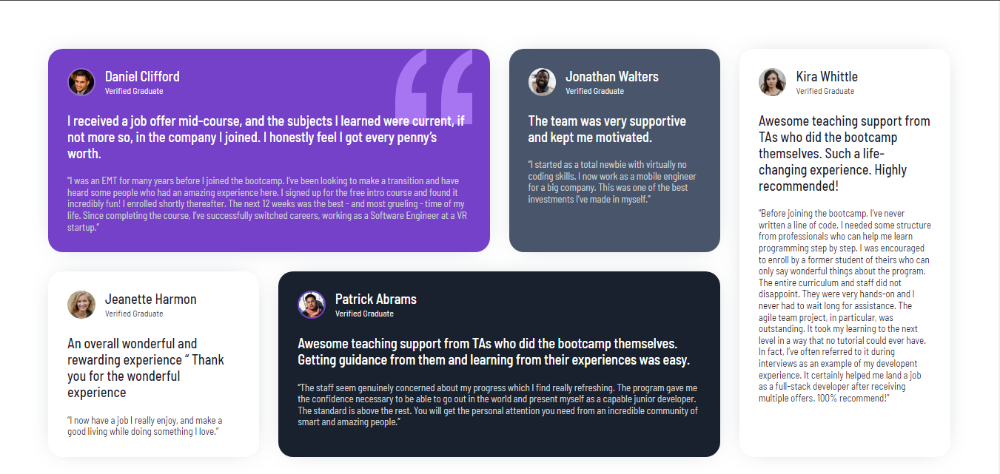

# Frontend Mentor - Testimonials grid section solution

This is a solution to the [Testimonials grid section challenge on Frontend Mentor](https://www.frontendmentor.io/challenges/testimonials-grid-section-Nnw6J7Un7).

## Table of contents

- [Overview](#overview)
  - [The challenge](#the-challenge)
  - [Screenshot](#screenshot)
  - [Links](#links)
- [My process](#my-process)
  - [Built with](#built-with)
  - [What I learned](#what-i-learned)
- [Author](#author)
- [Acknowledgments](#acknowledgments)

## Overview

### The challenge

Users should be able to:

- View the optimal layout for the site depending on their device's screen size

### Screenshot



### Links

- Solution URL: [https://github.com/Arkorede/testimonials-grid-section](https://github.com/Arkorede/testimonials-grid-section)
- Live Site URL: [https://testimonialz-grid.netlify.app/](https://testimonialz-grid.netlify.app/)

## My process

- I started by structuring the markup.
- Create reasuable and base styles.
- Added styling to the page.
- Worked on the responsiveness across all screens.
- Deployed the project using netlify ✨.

### Built with

- Semantic HTML5 markup
- CSS custom properties
- Flexbox
- CSS Grid
- Mobile-first workflow

### What I learned

I learned how to place and span grid items

```css
@media (min-width: 1024px) {
  .container {
    grid-template-columns: 1fr 1fr 1fr 1fr;
  }

  .bg--daniel {
    grid-row: 1 / 2;
    grid-column: 1 / 3;
  }

  .bg--jonathan {
    grid-row: 1 / 2;
    grid-column: 3 / 4;
  }

  .bg--kira {
    grid-column: 4 /5;
    grid-row: 1 / 3;
  }

  .bg--patrick {
    grid-row: 2 /3;
    grid-column: 2 / 4;
  }
}
```

## Author

- Website - [testimonialz-grid](https://testimonialz-grid.netlify.app/)
- Frontend Mentor - [@Arkorede](https://www.frontendmentor.io/profile/Arkorede)
- Twitter - [@IsraelAshaolu](https://twitter.com/IsraelAshaolu)

## Acknowledgments
